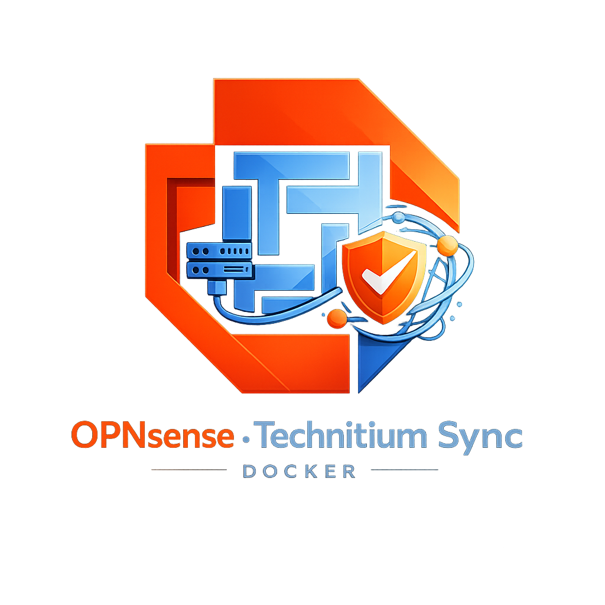

<p align="center">
  
</p>

<h1 align="center">OPNsense Technitium DNS Sync</h1>

<p align="center">
  <a href="https://github.com/RiDDiX/opnsense-technitium-sync/actions"></a>
  <a href="https://github.com/RiDDiX/opnsense-technitium-sync/pkgs/container/opnsense-technitium-sync"></a>
  
</p>

Syncs DHCP hostnames from OPNsense to Technitium DNS so your local devices are resolvable (e.g. `printer.home.arpa`). Runs as a Docker container, polls OPNsense every few minutes, and keeps Technitium's A-records in sync.

Works with **KEA DHCP**, **Dnsmasq**, **ISC DHCP** (legacy), **Unbound Host Overrides**, and **KEA Static Reservations**. Auto-detects which DHCP backend is active.

## Quick Start

Pull the image from GHCR:

```yaml
# docker-compose.yml
services:
  dns-sync:
    image: ghcr.io/riddix/opnsense-technitium-sync:latest
    container_name: opnsense-technitium-sync
    ports:
      - "8099:8099"
    env_file:
      - .env
    restart: unless-stopped
```

Or build locally:

```bash
git clone https://github.com/RiDDiX/opnsense-technitium-sync.git
cd opnsense-technitium-sync
cp .env.example .env
# edit .env
docker-compose up -d
```

## Configuration

All config is done via environment variables. Copy `.env.example` to `.env`:

| Variable | Default | Description |
|----------|---------|-------------|
| `OPNSENSE_URL` | `https://opnsense.home.arpa` | Your OPNsense URL |
| `OPNSENSE_API_KEY` | - | API key (see below) |
| `OPNSENSE_API_SECRET` | - | API secret (see below) |
| `OPNSENSE_VERIFY_SSL` | `false` | Set `true` if you have a proper cert |
| `TECHNITIUM_URL` | `http://technitium.home.arpa:5380` | Technitium admin URL |
| `TECHNITIUM_TOKEN` | - | API token from Technitium |
| `DNS_ZONE` | `home.arpa` | Target DNS zone |
| `SYNC_INTERVAL_MINUTES` | `5` | How often to sync |
| `LOG_LEVEL` | `INFO` | `DEBUG` / `INFO` / `WARNING` |
| `STATIC_ENTRIES` | - | Manual entries, e.g. `printer=192.168.1.50,nas=192.168.1.10` |
| `DASHBOARD_ENABLED` | `true` | Built-in status dashboard |
| `DASHBOARD_PORT` | `8099` | Dashboard port |

## API Permissions

### OPNsense

You need an API key with **read-only** access to DHCP data.

**Create a dedicated user:**

1. **System > Access > Users** — create a user (e.g. `api-dns-sync`)
2. **System > Access > Groups** — create a group, add the user
3. Assign these privileges to the group:

| Privilege | Purpose |
|-----------|---------|
| `XMLRPC Library` | Required for any API access |
| `Status: DHCP Leases` | Read lease data (ISC/Dnsmasq) |
| `Services: Kea DHCP` | Read KEA leases + reservations |
| `Services: Unbound DNS` | Read host overrides (optional) |

If you're not sure which DHCP server you're running, just grant all three. The tool figures it out automatically.

**Generate the key:**

1. **System > Access > Users** → click on the user
2. Scroll to **API keys** → click **+**
3. Download the key file — it contains the key and secret for your `.env`

### Technitium DNS

You need an API token with read/write access to manage zones and records.

1. Open Technitium admin panel (`http://<ip>:5380`)
2. Go to **Administration** → **Sessions**
3. Click **Create API Token**, name it something like `opnsense-sync`
4. Copy the token into your `.env`

The token needs access to these endpoints:

| Endpoint | Used for |
|----------|----------|
| `/api/zones/list` | Check if zone exists |
| `/api/zones/create` | Create zone on first run |
| `/api/zones/records` | Read existing records |
| `/api/zones/records/add` | Add new A-records |
| `/api/zones/records/delete` | Clean up stale records |

The default admin token covers all of this. The zone (`home.arpa`) gets created automatically if it doesn't exist yet.

## Dashboard

There's a built-in web dashboard at `http://<host>:8099` that shows:

- Current sync status and last/next sync time
- Record counts (total, added, updated, deleted)
- Searchable table of all synced DNS records
- Live log viewer with level filter

It's read-only and refreshes every 15 seconds. Disable with `DASHBOARD_ENABLED=false`.

Note: The dashboard loads Tailwind CSS from CDN, so the browser needs internet access.

## Usage

```bash
# view logs
docker-compose logs -f

# manual one-time sync
docker-compose exec dns-sync python sync.py --once

# debug: check which OPNsense API endpoints are available
docker-compose exec dns-sync python sync.py --discover
```

The `--discover` flag is useful when no leases show up — it tests all known DHCP endpoints and shows which ones respond.

## How It Works

```
OPNsense (KEA/Dnsmasq/ISC)  →  sync.py  →  Technitium DNS
         DHCP leases              diff         A-records
         reservations             apply        in home.arpa
```

Every `SYNC_INTERVAL_MINUTES` the script:
1. Fetches leases + reservations from OPNsense
2. Merges with any `STATIC_ENTRIES`
3. Diffs against existing Technitium records
4. Adds/updates/deletes as needed

## Troubleshooting

**No leases found** — Run `--discover` to see which endpoints respond. Check that your API user has the right privileges.

**401 Unauthorized** — Double-check key/secret in `.env`.

**404 on DHCP endpoints** — You might be running a different DHCP backend than expected. The tool tries KEA → Dnsmasq → ISC in order.

**"Domain does not belong to zone"** — Make sure `DNS_ZONE` matches what's configured in Technitium.

**SSL errors** — Set `OPNSENSE_VERIFY_SSL=false` for self-signed certs.

## License

MIT
